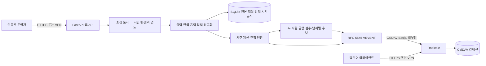

# 아키텍처와 위협 경계

## 경계

- 웹/API와 Radicale은 서로 다른 프로세스와 포트를 사용합니다.
- 웹은 단일 운영자 HTTP Basic 인증으로 모든 프로필·규칙 접근을 보호합니다.
- Radicale은 별도 자격 증명과 `owner_only` 권한으로 컬렉션을 보호합니다.
- 애플리케이션은 CalDAV 서버에 `MKCALENDAR`와 결정적 `PUT`만 수행합니다.
- 한국 음력 입력은 평달·윤달을 구분해 원본 그대로 저장하고, 계산 경계에서
  `korean-lunar-calendar` 0.4.0으로 양력 현지 시각을 만듭니다.
- 태어난 시각 미상은 `birth_time=NULL`, `birth_time_known=false`로 보존합니다.
  날짜 단위 일주 계산에만 현지 정오를 내부 기준점으로 쓰고, API의 시주는
  `null`로 반환합니다. 이 프로필은 일지 기반 두 사람 추천과 현재 시간 리터럴
  규칙을 사용할 수 있지만 출생 시주를 참조하는 규칙은 사용할 수 없습니다.
- 출생 도시 목록은 IANA 시간대와 경도를 서버에 보관합니다. 클라이언트에는 도시
  이름과 시간대만 전달하고 위도·경도 입력을 요구하거나 좌표를 응답하지 않습니다.
  목록 밖 출생지는 IANA 시간대를 직접 지정해 표준시로 계산할 수 있습니다.
- 위도는 받지 않습니다. 사용자가 진태양시를 명시적으로 선택하면 목록에서 고른
  도시의 경도만 서버 내부에서 자동 적용합니다.
- 규칙은 임의 코드나 식을 평가하지 않습니다. 8개 이하의 허용 필드 비교만
  역직렬화합니다.
- 두 사람 추천은 두 프로필의 출생 일지와 후보의 날짜·시간 지지를 비교하는
  고정된 허용 관계표만 사용합니다. 육충 후보를 제외하고 두 사람 중 낮은 점수를
  더 크게 반영합니다. 기본값은 첫 번째 사람의 민간시 09:00–23:00 안에서
  날짜마다 가장 높은 현재 이후 시간 하나를 남기며, 사용자가 선택하면 24시간
  전체를 검색합니다. 이 점수는 문화적 정렬 규칙이지 예측 모델의 확률이 아닙니다.
- iCalendar 이벤트는 사용자가 선택한 `CLASS:PRIVATE`, `CLASS:CONFIDENTIAL`,
  `CLASS:PUBLIC` 중 하나와 `TRANSP:TRANSPARENT`로 생성됩니다. 이 분류는 캘린더
  클라이언트 표시용이며 Radicale의 인증·`owner_only` 접근 제어를 바꾸지 않습니다.
  제목은 사용자가 붙인 중립적 캘린더 이름이고 설명은 일반 문장만 포함합니다.
  명식, 규칙, 천간·지지, 오행 또는 `X-SAJU-*` 속성은 CalDAV로 보내지 않습니다.
- 컨테이너는 비루트 UID, 읽기 전용 루트 파일시스템, 전체 Linux capability
  제거, `no-new-privileges`로 실행됩니다.

## 데이터

SQLite에는 프로필이 입력한 달력 종류, 평달·윤달, 출생 날짜, 선택 입력인 출생
시각과 시각 확인 여부, 변환된 양력 계산 시각, 선택한 도시, 성별, 시간대, 선택
경도, 계산된 명식과 캘린더 규칙·공개 수준을 저장합니다.
Radicale 볼륨에는 최소정보 iCalendar 리소스를 저장합니다. 어느 쪽도 공개 CI나
Git 저장소에 포함하면 안 됩니다.

미리보기와 일반 동기화의 날짜 범위를 생략하면 프로필 시간대의 현재 날짜부터
365일 뒤까지 검색하며 이미 끝난 시간은 제외합니다. 두 사람 추천은 이 범위에서
선택한 생활 시간 또는 24시간 전체 범위의 날짜별 최고 후보 하나를 고른 뒤 가까운
순으로 반환합니다. 브라우저의 시간대나 UTC 날짜 변환은 이 기본값에 관여하지
않습니다.

## 결정적 동기화

이벤트 UID는 캘린더 ID, 시작·종료 시각, 포맷 버전의 SHA-256에서 생성합니다.
같은 범위를 다시 동기화하면 같은 리소스 경로를 덮어써 중복 이벤트가 생기지
않습니다. 현재 버전은 범위에서 더 이상 일치하지 않는 과거 리소스를 자동 삭제하지
않으므로, 규칙을 바꿀 때는 새 slug를 쓰거나 기존 CalDAV 컬렉션을 삭제하십시오.
