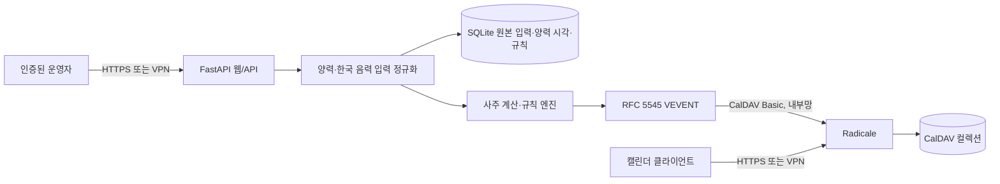

# 아키텍처와 위협 경계

## 경계

- 웹/API와 Radicale은 서로 다른 프로세스와 포트를 사용합니다.
- 웹은 단일 운영자 HTTP Basic 인증으로 모든 프로필·규칙 접근을 보호합니다.
- Radicale은 별도 자격 증명과 `owner_only` 권한으로 컬렉션을 보호합니다.
- 애플리케이션은 CalDAV 서버에 `MKCALENDAR`와 결정적 `PUT`만 수행합니다.
- 한국 음력 입력은 평달·윤달을 구분해 원본 그대로 저장하고, 계산 경계에서
  `korean-lunar-calendar` 0.4.0으로 양력 현지 시각을 만듭니다.
- 국가·지역의 IANA 시간대를 기본으로 사용합니다. 위도는 받지 않으며, 사용자가
  진태양시를 명시적으로 선택한 경우에만 경도를 사용합니다.
- 규칙은 임의 코드나 식을 평가하지 않습니다. 8개 이하의 허용 필드 비교만
  역직렬화합니다.
- iCalendar 이벤트는 `CLASS:PRIVATE`, `TRANSP:TRANSPARENT`로 생성됩니다.
  제목은 사용자가 붙인 중립적 캘린더 이름이고 설명은 일반 문장만 포함합니다.
  명식, 규칙, 천간·지지, 오행 또는 `X-SAJU-*` 속성은 CalDAV로 보내지 않습니다.
- 컨테이너는 비루트 UID, 읽기 전용 루트 파일시스템, 전체 Linux capability
  제거, `no-new-privileges`로 실행됩니다.

## 데이터

SQLite에는 프로필이 입력한 달력 종류, 평달·윤달, 출생 날짜·시각, 변환된 양력
현지 시각, 성별, 시간대, 선택 경도, 계산된 명식과 캘린더 규칙을 저장합니다.
Radicale 볼륨에는 최소정보 iCalendar 리소스를 저장합니다. 어느 쪽도 공개 CI나
Git 저장소에 포함하면 안 됩니다.

미리보기와 일반 동기화의 날짜 범위를 생략하면 프로필 시간대의 현재 날짜부터
365일 뒤까지 검색합니다. 브라우저의 시간대나 UTC 날짜 변환은 이 기본값에
관여하지 않습니다.

## 결정적 동기화

이벤트 UID는 캘린더 ID, 시작·종료 시각, 포맷 버전의 SHA-256에서 생성합니다.
같은 범위를 다시 동기화하면 같은 리소스 경로를 덮어써 중복 이벤트가 생기지
않습니다. 현재 버전은 범위에서 더 이상 일치하지 않는 과거 리소스를 자동 삭제하지
않으므로, 규칙을 바꿀 때는 새 slug를 쓰거나 기존 CalDAV 컬렉션을 삭제하십시오.
