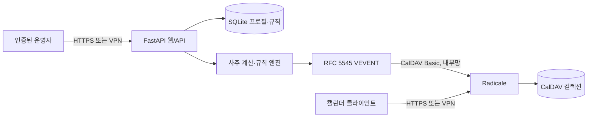

# 아키텍처와 위협 경계

## 경계

- 웹/API와 Radicale은 서로 다른 프로세스와 포트를 사용합니다.
- 웹은 단일 운영자 HTTP Basic 인증으로 모든 프로필·규칙 접근을 보호합니다.
- Radicale은 별도 자격 증명과 `owner_only` 권한으로 컬렉션을 보호합니다.
- 애플리케이션은 CalDAV 서버에 `MKCALENDAR`와 결정적 `PUT`만 수행합니다.
- 규칙은 임의 코드나 식을 평가하지 않습니다. 8개 이하의 허용 필드 비교만
  역직렬화합니다.
- iCalendar 이벤트는 `CLASS:PRIVATE`, `TRANSP:TRANSPARENT`로 생성됩니다.
- 컨테이너는 비루트 UID, 읽기 전용 루트 파일시스템, 전체 Linux capability
  제거, `no-new-privileges`로 실행됩니다.

## 데이터

SQLite에는 프로필의 출생 시각, 성별, 시간대, 경도, 계산된 명식과 캘린더
규칙을 저장합니다. Radicale 볼륨에는 생성한 iCalendar 리소스를 저장합니다.
어느 쪽도 공개 CI나 Git 저장소에 포함하면 안 됩니다.

## 결정적 동기화

이벤트 UID는 캘린더 ID, 시작·종료 시각, 포맷 버전의 SHA-256에서 생성합니다.
같은 범위를 다시 동기화하면 같은 리소스 경로를 덮어써 중복 이벤트가 생기지
않습니다. 현재 버전은 범위에서 더 이상 일치하지 않는 과거 리소스를 자동 삭제하지
않으므로, 규칙을 바꿀 때는 새 slug를 쓰거나 기존 CalDAV 컬렉션을 삭제하십시오.
