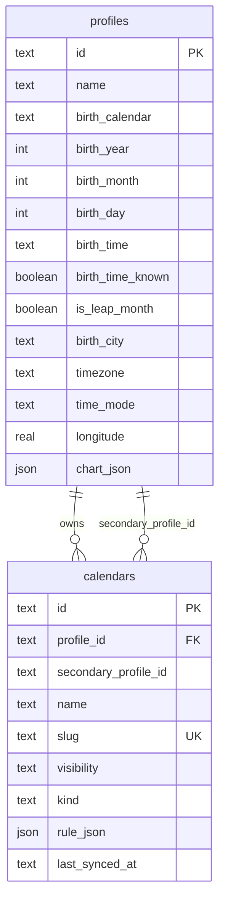

# ERD / 저장 구조

`secondary_profile_id`는 SQLite foreign key 없이 애플리케이션에서 검증하는
궁합 보조 참조다. 프로필 삭제 전에 양쪽 참조를 검색하고, 주 참조 삭제는
`ON DELETE CASCADE`로 로컬 캘린더를 정리한다. `chart_json`과 `rule_json`은
CalDAV 이벤트로 복사하지 않는 민감·내부 표현이다.
