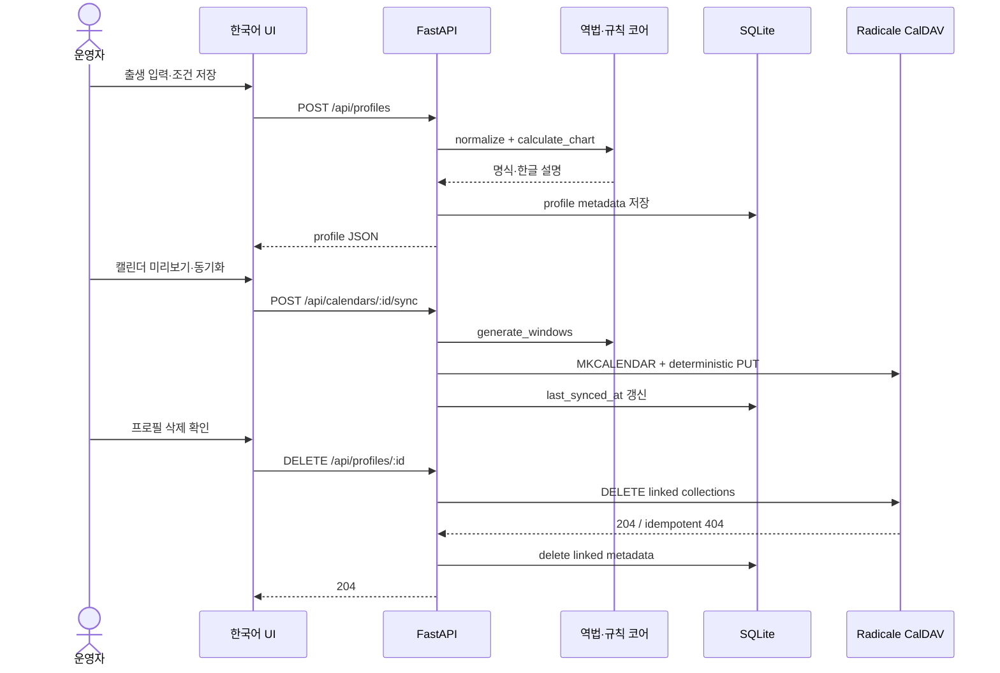

# UML / 시퀀스 개요

```mermaid
sequenceDiagram
  actor Operator as 운영자
  participant UI as 한국어 UI
  participant API as FastAPI
  participant Core as 역법·규칙 코어
  participant DB as SQLite
  participant DAV as Radicale CalDAV

  Operator->>UI: 출생 입력·조건 저장
  UI->>API: POST /api/profiles
  API->>Core: normalize + calculate_chart
  Core-->>API: 명식·한글 설명
  API->>DB: profile metadata 저장
  API-->>UI: profile JSON
  Operator->>UI: 캘린더 미리보기·동기화
  UI->>API: POST /api/calendars/:id/sync
  API->>Core: generate_windows
  API->>DAV: MKCALENDAR + deterministic PUT
  API->>DB: last_synced_at 갱신
  Operator->>UI: 프로필 삭제 확인
  UI->>API: DELETE /api/profiles/:id
  API->>DAV: DELETE linked collections
  DAV-->>API: 204 / idempotent 404
  API->>DB: delete linked metadata
  API-->>UI: 204
```

삭제 경로에서 DAV 오류가 나면 DB 단계로 진행하지 않고 502로 종료한다. 계산 코어는
네트워크 없이도 테스트할 수 있고, 발행자는 RFC 경계로 교체할 수 있다.
