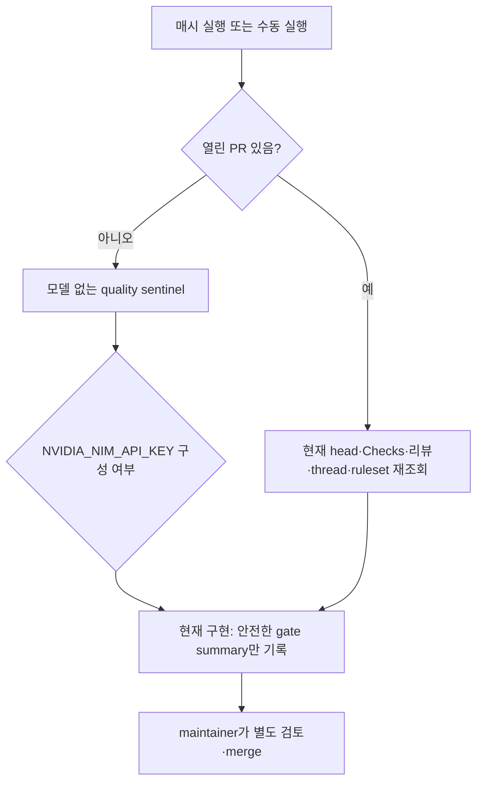

# 시간별 제품 개발 루프

## 목표

매시 한 번 제품 품질을 점검하고, 오래된 PR을 먼저 정리한 뒤 구매자에게 가치가
있는 하나의 작은 개선만 다음 PR 후보로 만든다. 계산 결과와 개인정보 경계는
모델이 수정할 수 없는 결정적 검증 대상이다.

## 실행 순서

## 운영 규칙

- schedule은 `17 * * * *`, `workflow_dispatch`를 함께 둔다. concurrency는 저장소별
  single-flight이고 `cancel-in-progress: false`다.
- 현재 workflow에는 NIM 모델 실행이나 publisher가 없다. `NVIDIA_NIM_API_KEY`의
  구성 여부만 기록하며 `COPILOT_GITHUB_TOKEN`을 만들거나 전달하지 않고,
  reviewer-agent 기존 키도 건드리지 않는다.
- quality sentinel은 source/test/docs 계약을 결정적으로 점검하고 운영 DB·CalDAV·
  SSH에 접근하지 않는다. 열린 PR이 있으면 후보의 현재 head와 Checks·리뷰·
  unresolved thread·ruleset 조회가 끝날 때까지 proposal을 시작하지 않는다.
- 자동화는 merge/release/deploy하지 않는다. NIM 실행·bounded patch·무자격
  verifier·PR publisher는 ADR-0003의 향후 설계이며, 자격 증명과 실행 계약이
  추가되기 전에는 동작한다고 주장하지 않는다.
- 키·provider가 없을 때도 sentinel 결과와 건너뛴 이유를 보존한다. 실패를 녹색으로
  위장하지 않는다.

## Sentinel naming contract

운영자가 직접 실행할 때는 `uv run python scripts/hourly_product_loop.py
--output-format text`를 사용한다. 다른 checkout을 검사할 때만
`--repository-root <path>`를 추가한다. 조직이 소유하는 Python/JSON 계약은
`run_quality_sentinel`, `_run_sentinel_command`, `check_name`, `check_status`,
`check_detail`, `elapsed_seconds`, `sentinel_status`, `check_results`를 canonical
용어로 사용한다. 이전 generic `_run`, `run`, `name`, `status`, `detail`, `seconds`,
`--root`, `--format`, JSON `status`/`checks`는 이 repository의 외부 표준이나 vendor
계약이 아니며 canonical 계약으로 유지하지 않는다.

GitHub GraphQL query의 `owner`, `name`, `status`처럼 GitHub가 정의한 field 이름과
Python `subprocess.run` keyword는 외부 contract이므로 그대로 둔다. workflow 내부
shell 변수는 `repository_owner`, `repository_name`처럼 bounded meaning으로 번역해
사용한다.

## 성공 증적

workflow summary에는 검사 결과, 현재 PR의 SHA prefix·상태 요약, 다음 수동 단계만
남긴다. 출생 원문·CalDAV URL의 비밀·토큰은 남기지 않는다. 실제 NIM patch가
생성되지 않으므로 patch digest와 PR 발행 증적은 현재 산출물이 아니다.
