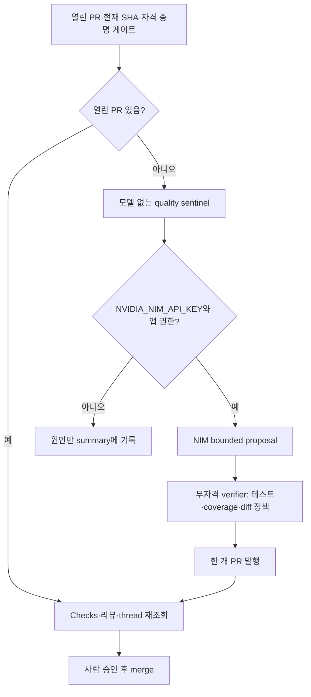

# 시간별 제품 개발 루프

## 목표

매시 한 번 제품 품질을 점검하고, 오래된 PR을 먼저 정리한 뒤 구매자에게 가치가
있는 하나의 작은 개선만 다음 PR 후보로 만든다. 계산 결과와 개인정보 경계는
모델이 수정할 수 없는 결정적 검증 대상이다.

## 실행 순서

## 운영 규칙

- schedule은 `17 * * * *`, `workflow_dispatch`를 함께 둔다. concurrency는 저장소별
  single-flight이고 `cancel-in-progress: false`다.
- 모델 작업은 `NVIDIA_NIM_API_KEY`만 사용한다. `COPILOT_GITHUB_TOKEN`을 만들거나
  전달하지 않으며, reviewer-agent 기존 키는 건드리지 않는다.
- 모델은 source/test/docs만 읽고 운영 DB·CalDAV·SSH·외부 웹·`git push`·`gh`에
  접근하지 못한다. base SHA, 변경 파일 수, diff byte, symlink/gitlink를 제한한다.
- verifier는 모델·쓰기 자격 증명 없이 전체 테스트/coverage/ruff/lock/docs 계약을
  실행하고 patch digest를 비교한다. publisher가 maintainer 앱 토큰을 마지막에
  주입해 검증된 patch만 PR로 만든다.
- 자동화는 merge/release/deploy하지 않는다. 열린 PR이 생기면 다음 시간부터
  proposal을 멈추고 현재 head의 모든 Checks, 리뷰, unresolved thread, ruleset을
  재조회한다.
- 키·provider가 없을 때도 sentinel 결과와 건너뛴 이유를 보존한다. 실패를 녹색으로
  위장하지 않는다.

## 성공 증적

workflow summary에는 기준 SHA, 테스트·coverage 요약, patch digest, 변경 파일 수,
PR 번호와 다음 수동 단계만 남긴다. 출생 원문·CalDAV URL의 비밀·토큰은 남기지 않는다.
