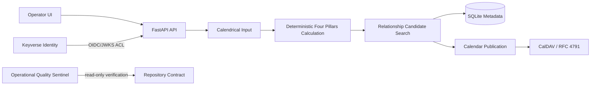
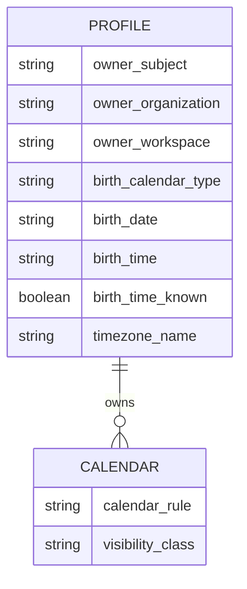

# Product Technical Gap Baseline

Status: Proposed while pull request #46 is Draft and fresh exact-head verification/review are incomplete.

Evidence baseline: protected `main@f56627e31c2989083b7166042910fc143c02233e`; naming-repair evidence is tracked on `refactor/semantic-sentinel-identifiers` and must be re-bound to its exact current head after each write.

## Buyer PRD and product responsibility

`saju-caldav` is an operator-facing calendrical product that accepts solar or Korean-lunar birth input, preserves unknown birth time without invention, computes deterministic Four Pillars reference information and bounded relationship-condition candidates, and publishes user-selected results to a personal CalDAV calendar. Product language must not present the cultural calculation as scientific prediction, diagnosis, legal, financial, or medical advice.

The product owns calendrical input normalization, deterministic Four Pillars calculation, relationship-candidate search, local profile/calendar metadata, and the application-to-CalDAV publication boundary. Keyverse is an external identity authority consumed through token verification; CalDAV/iCalendar and GitHub contracts remain external protocol boundaries.

## TRD and context map

DDD responsibility map for this evidence slice:

- **Calendrical Input bounded context** — normalizes solar/Korean-lunar date, leap-month, location/timezone, optional birth time, and the explicit true-solar-time choice.
- **Deterministic Four Pillars Calculation bounded context** — owns calendrical calculation rules and their cited conventions; deterministic calculation remains separate from external I/O.
- **Relationship Candidate Search bounded context** — owns `pair_relation_activation` and `shared_branch_relations` candidate semantics and explanatory indicators/metrics without treating them as predictive probabilities.
- **Calendar Publication bounded context** — maps selected candidates to minimal-information RFC 5545 VEVENT resources and the CalDAV write/delete lifecycle.
- **Identity access-control boundary** — consumes verified Keyverse claims and maps them to the application-owned profile ownership scope; Keyverse field names and token protocol stay outside product ubiquitous language.
- **Operational Quality Sentinel supporting context** — owns repository verification vocabulary only. It does not own calendrical domain truth, customer data, deployment, merge, or release authority.

Aggregate boundaries remain intentionally small: profile/calendar metadata and synchronization operations must not expand into a single transaction aggregate containing identity-provider state or remote CalDAV storage. Remote publication/deletion failure remains fail-closed before local destructive completion.

## Persistence and ERD baseline

This diagram is a bounded conceptual view, not a declaration of exact physical column names. SQLite stores profile ownership scope, original calendrical input, normalized calculation state, and calendar rule/publicity metadata; Radicale stores only the minimal iCalendar resources. Any future physical database rename must separately verify migrations, foreign keys, indexes, ORM/query mappings, 3NF, UPSERT paths, hot-partition behavior, locking/read-write separation, backward compatibility, and rollback safety before changing persisted objects.

## Organization naming-contract status

PR #46 repairs a verified organization-owned operational naming boundary. Canonical terminology is:

| Previous owned name | Canonical name | Boundary |
| --- | --- | --- |
| `_run` | `_run_sentinel_command` | Python sentinel command adapter |
| `run` | `run_quality_sentinel` | Python sentinel orchestration |
| `name` | `check_name` | `CheckResult` |
| `status` | `check_status` | `CheckResult` |
| `detail` | `check_detail` | `CheckResult` |
| `seconds` | `elapsed_seconds` | `CheckResult` |
| JSON `status` | `sentinel_status` | owned sentinel JSON |
| JSON `checks` | `check_results` | owned sentinel JSON |
| `--root` | `--repository-root` | owned sentinel CLI |
| `--format` | `--output-format` | owned sentinel CLI |
| workflow `owner` | `repository_owner` | owned shell variable |
| workflow `repo` | `repository_name` | owned shell variable |

GitHub GraphQL/REST fields such as `owner`, `name`, `status`, and Python `subprocess.run` keyword arguments are externally defined and remain unchanged at the adapter boundary. No database table/column/index/constraint, CalDAV/iCalendar field, Keyverse token field, or calendrical public API is renamed by #46.

Executable contract coverage requires the semantic dataclass fields, helper/orchestration names, CLI flags, workflow-local repository variables, and JSON serialization keys and explicitly rejects the superseded generic owned forms.

## Gap and action status

| Gap | Causal owner | Action | Status |
| --- | --- | --- | --- |
| Hourly sentinel Python/JSON/CLI/workflow vocabulary used generic organization-owned names | `ContextualWisdomLab/saju-caldav` | RED naming contract, propagate semantic names through source/workflow/tests/docs | Repaired on #46; exact-head checks/review pending |
| Repository lacked this product/technical gap baseline | `ContextualWisdomLab/saju-caldav` | Establish evidence-bound PRD/TRD/DDD/ERD/naming/security/test/operability baseline | Added on #46; keep current with protected-head evidence |
| Direct CalDAV subject-level isolation is not established by Keyverse web/API ownership scope | Calendar Publication / deployment boundary | Do not claim subject-isolated CalDAV; require separate account/ACL design and cross-scope tests before claiming it | Explicitly bounded in `docs/ARCHITECTURE.md` |

## Security, test, and operability baseline

Public tests and CI use synthetic birth data only. The quality sentinel captures subprocess output but emits only redacted summaries; it does not access production SQLite, CalDAV, SSH, or customer data. Repository guidance requires lock validation, pytest coverage, coverage reporting, Ruff, diff hygiene, and CodeGraph synchronization where available. Container operation is documented as non-root, read-only root filesystem, no-new-privileges, and capability-drop deployment.

For #46, the required acceptance evidence is fresh on the unchanged final head: semantic naming regression coverage, the broader repository test/coverage/lint checks, current review state and unresolved threads, and any live security/governance workflows. No predecessor-head result is merge evidence.

## UX, localization, and visual evidence

This naming slice does not alter buyer UI, localization resources, CSS, component structure, or browser behavior. No Figma, Storybook, screenshot, or E2E visual evidence was established by this slice; none is claimed. A future UI change must establish the applicable normal/loading/empty/error/permission/responsive/interaction and locale evidence rather than inheriting this operational-contract verification.

## Research and decision traceability

Calendrical formula or convention changes remain paper/primary-source first per repository guidance and `docs/research/README.md`. Protocol decisions should cite the authoritative iCalendar/CalDAV/WebDAV RFCs in the owning ADR/research records. This naming repair is a software-contract clarification rather than a change to psychometric, statistical, calendrical, or cultural claims, so it introduces no new empirical claim requiring a new research citation.
