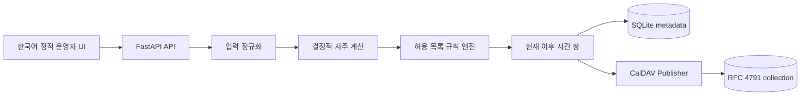

# 기술 요구사항 문서 (TRD)

## 모듈 경계

각 모듈은 순수 계산과 외부 I/O를 분리한다. `app/saju.py`, `app/birth.py`,
`app/events.py`, `app/rules.py`는 동일 입력에서 동일 결과를 내는 핵심 경계다.
`app/store.py`는 SQLite, `app/caldav.py`는 HTTP/RFC 경계, `app/main.py`는 인증과
오케스트레이션을 담당한다.

## 시간·달력 계약

- 입력은 출생지 현지 벽시각이며 양력 또는 한국 음력 평달/윤달을 원본과 함께
  저장한다.
- 도시 선택은 서버의 IANA 시간대와 대표 경도를 사용한다. 표준 민간시가 기본이고
  진태양시는 명시 선택일 때만 근사 보정한다. 위도 입력은 요구하지 않는다.
- 시각 미상은 `birth_time=NULL`, `birth_time_known=false`이며 내부 정오는
  날짜 단위 일주 계산용 기준점일 뿐 출생 시각 추정값으로 표시하지 않는다.
- 날짜 검색은 프로필 시간대의 현재 이후부터 최대 730일, 기본 생활 시간은
  09:00–23:00이다.

## API 계약

프로필·캘린더 CRUD, `/preview`, `/sync`, `/compatibility/calendars`는 JSON을
사용하고 삭제는 204를 반환한다. 동기화된 원격 컬렉션을 지우지 못하면 삭제
endpoint는 502를 반환하고 로컬 행을 남긴다. 예측·운세 표현 대신 계산 설명과
불확실성만 반환한다.

## 배포·확장

Docker는 non-root, read-only root filesystem, no-new-privileges, capability 제거를
사용한다. 단독 운영은 SQLite/Radicale compose로 충분하며, MSA로 확장할 때도
계산 worker가 개인정보를 CalDAV 이벤트로 흘리지 않도록 `Store`/`Publisher`를
메시지 경계 뒤에 둘 수 있어야 한다. 새 DB object는 의미 있는 두 단어 이상
snake_case 이름을 사용한다.
